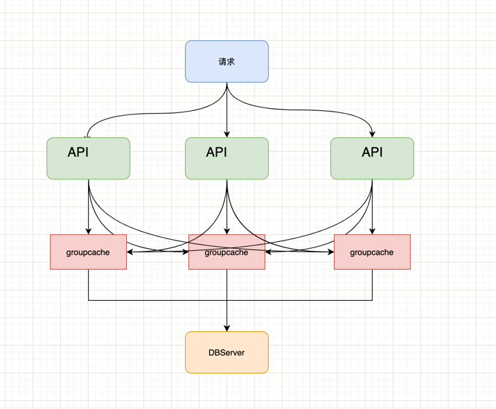

## groupcache-db-example

这是一个使用groupcache的例子

### 如何让这个例子跑起来

* git clone git@github.com:colinrs/groupcache-db-example.git
* cd groupcache-db-example
* make run
  * 将API和 DBServer编译
  * 将API服务和DBServer服务在后台启动
    
### example 架构如下

* API服务接收来自用户的请求
  * 每一个API服务都有一个groupcache实例
* groupcache 最终的数据源是 DBServer

### API 接口

* /get
  * 获取Key对应的Value 
  * open http://127.0.0.1:9001/get?key=key_50
* /where
  * 返回key应该在哪一个groupcache上请求
  * open http://127.0.0.1:9001/where?key=key_50

### DBServer 接口

* /get
  * 获取Key对应的Value 
  * open http://127.0.0.1:9005/get?key=key_50
* /set
  * 设置Key对应的Value
  * open http://127.0.0.1:9005/set?key=key_50&value=152425
* /del
   * 删除Key
   * open http://127.0.0.1:9005/del?key=key_50
* /clean
  * 清空数据
  * open http://127.0.0.1:9005/clean
* /look
  * 查看全部数据 
  * open http://127.0.0.1:9005/look
